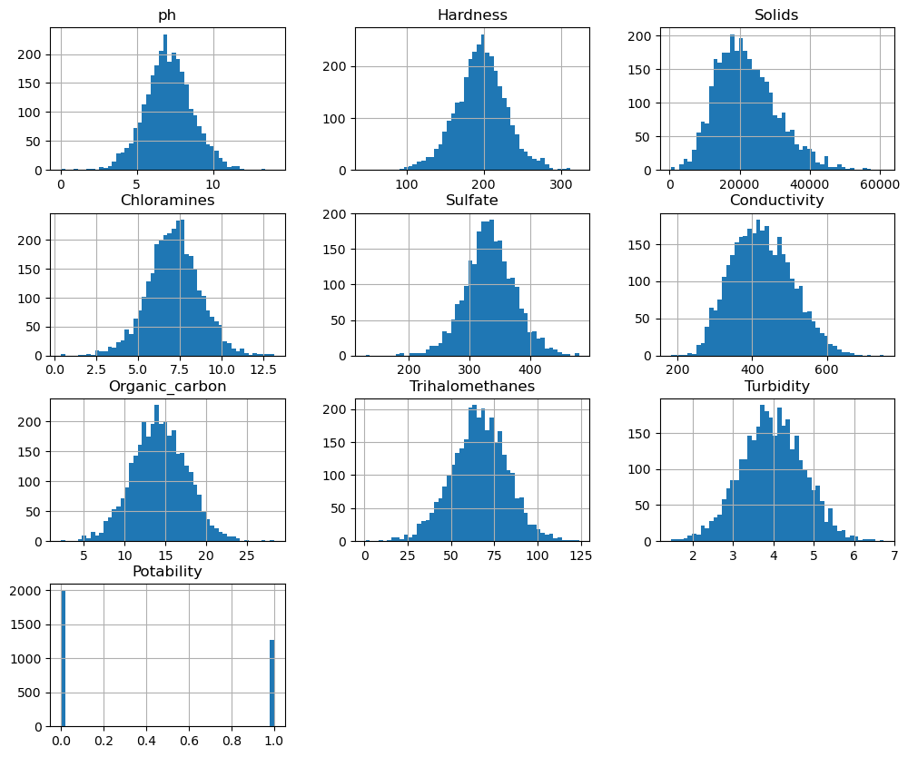
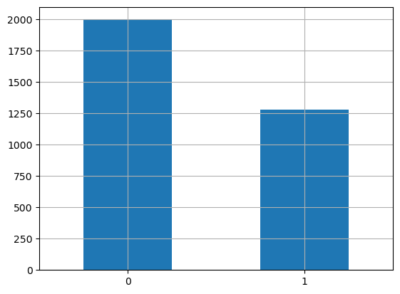
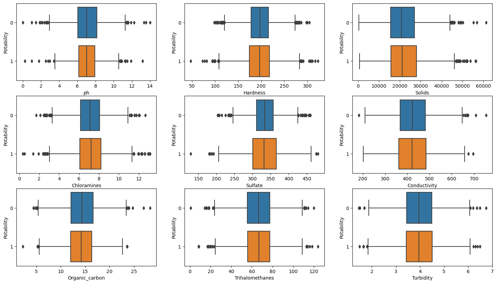
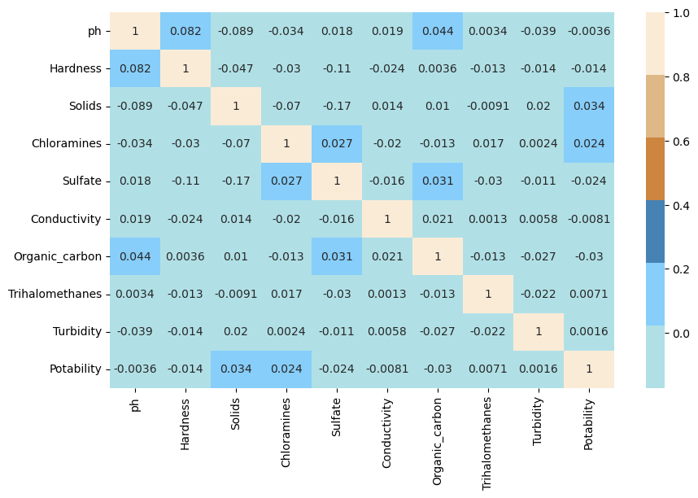
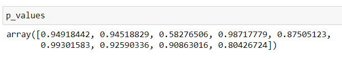
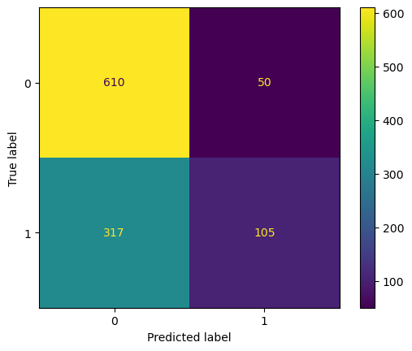
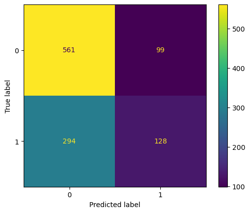
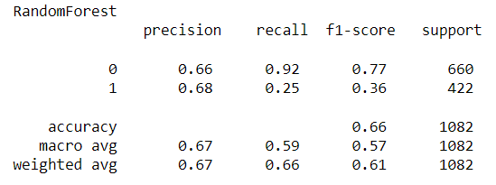
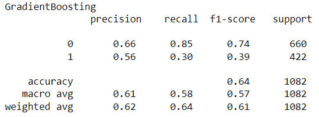

# Analisi Acqua Potabile

In questo progetto, l'obiettivo è quello di costruire un modello che determini la potabilità dell'acqua in base alle sue caratteristiche chimiche.  

## Obiettivi
- Analizzare e visualizzare le features del dataset.
- Individuare eventuali correlazioni tra le features e la classe target.
- Creare un modello *Dummy* randomico per stabilire un livello base di prestazioni.
- Creare il milgiore modello di classificazione utilizzando tutte le features a disposizione (Modello1).
- Creare il milgiore modello di classificazione utilizzando le migliori quattro features (Modello2).

## Analisi
Il dataset è composto da $9$ features più la classe target, nello specifico:
- ph: Indica il ph dell'acqua (0-14).
- Hardness: Capacità dell'acqua di precipitare in sapone mg/L.
- Solids: Solidi totali disciolti in ppm.
- Chloramines: Quantità di Clorammine in ppm.
- Sulfate: Quantità di Solfati disciolti in mg/L.
- Conductivity: Conducibilità elettrica dell'acqua in μS/cm.
- Organic_carbon: Quantità di carbonio organico in ppm.
- Trihalomethanes: Quantità di Trialometani in μg/L.
- Turbidity: Misura delle proprietà di diffusione della luce dell'acqua in NTU.
- Potability: Indica se l'acqua è sicura per il consumo umano.

Nello specifico nella visualizzazione delle distribuzioni è evidente lo sbilanciamento della **classe target**:

Questo sbilanciamento della classe target, potrebbe compromettere il modello nel caso in cui si eseguisse un campionamento casuale (random sampling), per ovviare a questo problema viene utilizzato come campionamento lo **startified sampling** che tiene conto della distribuzione delle etichette di classe.

In aggiunta, è possibile notare come il dataset contenga diversi **outliers**, che tramite l'algoritmo di *IsolationForest*, possiamo stimare intorno al $10$% dei dati totali del dataset. 

## Correlazioni
Utilizzando la matrice di correlazione possiamo ottenere la relazione tra le variabili del dataset, con valori che possono variare tra $-1$ e $1$, con il valore $0$ che indica assenza di correlazione.

Dalla matrice possiamo notare come vi sia una bassa correlazione tra le variabili e la classe target. 
Relazione confermata anche dal Chi-square test, che indica la dipendenza tra variabile target e features se il risultato è al di sotto del valore soglia (0.05), ma anche in questo caso otteniamo dei valori che indicano una bassa correlazione.

## Modello Dummy
Utilizzando il modello Dummy randomico otteniamo un livello base prestazionale dei modelli, utile quindi per valutare la bontà dei reali modelli.
Come metrica utlizziamo l'accuracy che indica il numero di previsioni corrette sulle totali fatte ed otteniamo un valore di circa il $50$% di previsioni corrette.

## Modello 1
Per il modello $1$ verranno testati $5$ diversi algoritmi con tutte le features del dataset a disposizione, Logistic Regression, RandomForest, K-nearest neighbors, Decision Tree e Gradient Boosting, tra questi $5$ ci concentremo sui $2$ che hanno avuto i migliori risultati rispetto all'accuracy,nello specifico RandomForest e Gradient Boosting e effettueremo il tuning degli iperparametri.
Ottenendo quindi una accuracy del $66$% per il RandomForest e del $64$% per il GradientBoosting, più i seguenti valori per la matrice di confusione e precision, recall e f1 score.
**Random Forest**&nbsp;&nbsp;&nbsp;&nbsp;&nbsp;&nbsp;&nbsp;&nbsp;&nbsp;&nbsp;&nbsp;&nbsp;&nbsp;&nbsp;&nbsp;&nbsp;&nbsp;&nbsp;&nbsp;&nbsp;&nbsp;&nbsp;&nbsp;&nbsp;&nbsp;&nbsp;&nbsp;&nbsp;&nbsp;&nbsp;&nbsp;&nbsp;&nbsp;&nbsp;&nbsp;&nbsp;&nbsp;&nbsp;&nbsp;&nbsp;&nbsp;&nbsp;&nbsp;&nbsp;&nbsp;&nbsp;&nbsp;**Gradient Boosting**

  
    

  
  

